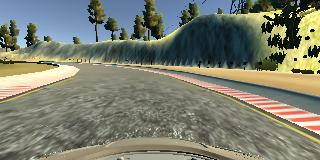
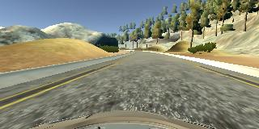
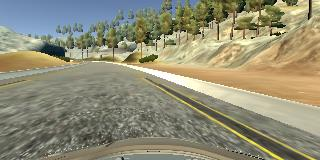
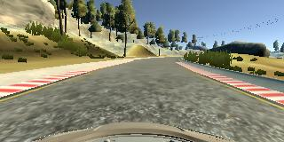

# **Behavioral Cloning** 

## Writeup Template

### You can use this file as a template for your writeup if you want to submit it as a markdown file, but feel free to use some other method and submit a pdf if you prefer.

---

**Behavioral Cloning Project**

The goals / steps of this project are the following:
* Use the simulator to collect data of good driving behavior
* Build, a convolution neural network in Keras that predicts steering angles from images
* Train and validate the model with a training and validation set
* Test that the model successfully drives around track one without leaving the road
* Summarize the results with a written report


[//]: # (Image References)

[image1]: ./examples/placeholder.png "Model Visualization"
[image2]: ./examples/placeholder.png "Grayscaling"
[image3]: ./examples/placeholder_small.png "Recovery Image"
[image4]: ./examples/placeholder_small.png "Recovery Image"
[image5]: ./examples/placeholder_small.png "Recovery Image"
[image6]: ./examples/placeholder_small.png "Normal Image"
[image7]: ./examples/placeholder_small.png "Flipped Image"

## Rubric Points
### Here I will consider the [rubric points](https://review.udacity.com/#!/rubrics/432/view) individually and describe how I addressed each point in my implementation.  

---
### Files Submitted & Code Quality

#### 1. Submission includes all required files and can be used to run the simulator in autonomous mode

My project includes the following files:
* model.py containing the script to create and train the model
* drive.py for driving the car in autonomous mode
* model.h5 containing a trained convolution neural network 
* writeup_report.md or writeup_report.pdf summarizing the results

#### 2. Submission includes functional code
Using the Udacity provided simulator and my drive.py file, the car can be driven autonomously around the track by executing 
```sh
python drive.py model.h5
```

#### 3. Submission code is usable and readable

The model.py file contains the code for training and saving the convolution neural network. The file shows the pipeline I used for training and validating the model, and it contains comments to explain how the code works.

### Model Architecture and Training Strategy

#### 1. An appropriate model architecture has been employed

I have used the Inception NN as below:
I have added a cropping layer in the fron the NN as well as some fully connected layer by the end.
it turns out that this does not works very as we will discuss this later.
This is the first approach for the model architecture(end I used Navidia NN mentioned later)


Layer (type)                 Output Shape              Param #
=================================================================
|input_2 (InputLayer)      |   (None, 160, 320, 3)     |  0
_________________________________________________________________
cropping2d_1 (Cropping2D)    (None, 75, 320, 3)        0
_________________________________________________________________
inception_v3 (Model)         (None, 1, 8, 2048)        21802784
_________________________________________________________________
flatten_1 (Flatten)          (None, 16384)             0
_________________________________________________________________
dense_1 (Dense)              (None, 512)               8389120
_________________________________________________________________
dropout_1 (Dropout)          (None, 512)               0
_________________________________________________________________
dense_2 (Dense)              (None, 256)               131328
_________________________________________________________________
dropout_2 (Dropout)          (None, 256)               0
_________________________________________________________________
dense_3 (Dense)              (None, 128)               32896
_________________________________________________________________
dropout_3 (Dropout)          (None, 128)               0
_________________________________________________________________
dense_4 (Dense)              (None, 10)                1290
_________________________________________________________________
dense_5 (Dense)              (None, 1)                 11
=================================================================
Total params: 30,357,429
Trainable params: 8,554,645
Non-trainable params: 21,802,784


#### 2. Attempts to reduce overfitting in the model

I have trained the NN 10 epoch time and it turns out that the cost around 5 epoch time would not change much , so I have called an early stop at epoch time of 5 as regulation mechanism.


#### 3. Model parameter tuning

The model used an adam optimizer default parametre and the epoch time was set at 5 and it turns out to the the sweet spot in turns of the performance as well as training time

#### 4. Appropriate training data

The Training data consists of different driving styles:
1. Keep in the middle of the lane as much as posssible 4 labs
2. Recover from the side of the lane swabbling 2 labs
3. Smooth driving 3 labs
4. The other drection of the lane same process as above repeat

### Model Architecture and Training Strategy

#### 1. Solution Design Approach

My first attempt was to use the inception network with the tranfer learninig, and remove the top and add some conv layers and then 3 more fully connected layers.
I have freezed the training parametre of the inception previous layers to take the advantage of the low level features.
However it turns out that the data overfits significantly there is a big difference between training data and validation data.
The training data for ineception network are mostly the real world images while the traininig and testing image that we use in this project are from the 3D simulation, so they are from the different distribution.

So my approach was to train the network from stracth , since this training set is very different from the inception network and I have got pretty decent training sets, about 18000 pics, I decicde to use Navidia Network structure as describe above.

By using this network and traing from stratch eliminate the problem of overfiting and has achieve bring the trainnig cost as well as validation cost down to a reasonable level, as it performs smoothly in the simulation.


#### 2. Final Model Architecture
Layer (type)                 Output Shape              Param #
=================================================================
cropping2d_1 (Cropping2D)    (None, 90, 320, 3)        0
_________________________________________________________________
conv2d_1 (Conv2D)            (None, 43, 158, 24)       1824
_________________________________________________________________
batch_normalization_1 (Batch (None, 43, 158, 24)       96
_________________________________________________________________
activation_1 (Activation)    (None, 43, 158, 24)       0
_________________________________________________________________
conv2d_2 (Conv2D)            (None, 20, 77, 36)        21636
_________________________________________________________________
batch_normalization_2 (Batch (None, 20, 77, 36)        144
_________________________________________________________________
activation_2 (Activation)    (None, 20, 77, 36)        0
_________________________________________________________________
conv2d_3 (Conv2D)            (None, 8, 37, 48)         43248
_________________________________________________________________
batch_normalization_3 (Batch (None, 8, 37, 48)         192
_________________________________________________________________
activation_3 (Activation)    (None, 8, 37, 48)         0
_________________________________________________________________
conv2d_4 (Conv2D)            (None, 6, 35, 64)         27712
_________________________________________________________________
batch_normalization_4 (Batch (None, 6, 35, 64)         256
_________________________________________________________________
activation_4 (Activation)    (None, 6, 35, 64)         0
_________________________________________________________________
conv2d_5 (Conv2D)            (None, 4, 33, 64)         36928
_________________________________________________________________
batch_normalization_5 (Batch (None, 4, 33, 64)         256
_________________________________________________________________
activation_5 (Activation)    (None, 4, 33, 64)         0
_________________________________________________________________
flatten_1 (Flatten)          (None, 8448)              0
_________________________________________________________________
dense_1 (Dense)              (None, 100)               844900
_________________________________________________________________
batch_normalization_6 (Batch (None, 100)               400
_________________________________________________________________
activation_6 (Activation)    (None, 100)               0
_________________________________________________________________
dense_2 (Dense)              (None, 50)                5050
_________________________________________________________________
batch_normalization_7 (Batch (None, 50)                200
_________________________________________________________________
activation_7 (Activation)    (None, 50)                0
_________________________________________________________________
dense_3 (Dense)              (None, 10)                510
_________________________________________________________________
batch_normalization_8 (Batch (None, 10)                40
_________________________________________________________________
activation_8 (Activation)    (None, 10)                0
_________________________________________________________________
dense_4 (Dense)              (None, 1)                 11
=================================================================
Total params: 983,403
Trainable params: 982,611
Non-trainable params: 792


Here is a visualization of the architecture (note: visualizing the architecture is optional according to the project rubric)


#### 3. Creation of the Training Set & Training Process

To capture good driving behavior, I first recorded two laps on track one using center lane driving. Here is an example image of center lane driving:



I then recorded the vehicle recovering from the left side and right sides of the road back to center so that the vehicle would learn to how to recover if really close to the lane line.




To augment the data sat, I drove the car from the opposite direction of the track as you can see that the original track was left bias , right now this lap is right bias:




So I combine the opposite direction driving data with the original data to create the whole training set.
Then I shuffle the data and split 20% for the validation set and feed into the NN.
